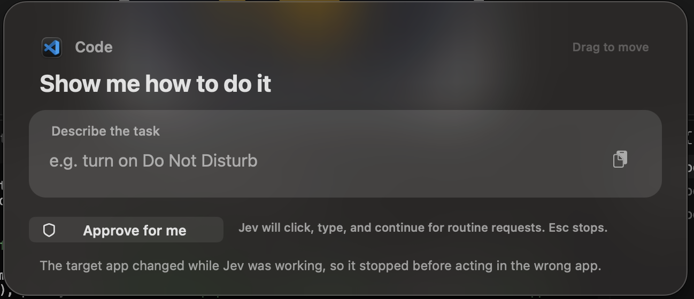

# jev — macOS assistant

Answers, acts, and guides on-screen with a live cursor.



```sh
./run.sh "question"  # CLI
./build-app.sh       # rebuild + launch
open Jev.app         # UI, double-Cmd toggles
```

Option-Right advances guide, Escape stops.

Things you can say:

Instant — `turn on Do Not Disturb`, `dark mode`, `volume 40`, `mute`,
`set a 5 min timer`, `open Spotify`.

Does it — `play SICKO MODE by Travis Scott on Spotify`.

Shows you, in the right app — `turn on Wi-Fi`, `change my wallpaper`,
`create a calendar event`, anything naming an app.

Answers as text — `what's sequestration?`, `explain ...`, `write ...`

Click **Approve for me** in the prompt to let Jev complete routine, visible
steps itself (click, type, shortcut, scroll, and verify). It stays off by
default and pauses for passwords, payments, deletions, and security/privacy
prompts; messages are sent only when your request explicitly asks for one.

Setup: `.env` with `AI_GATEWAY_API_KEY`, `AI_GATEWAY_MODEL=vmc/jev`.
Needs Screen Recording + Accessibility + Input Monitoring.
